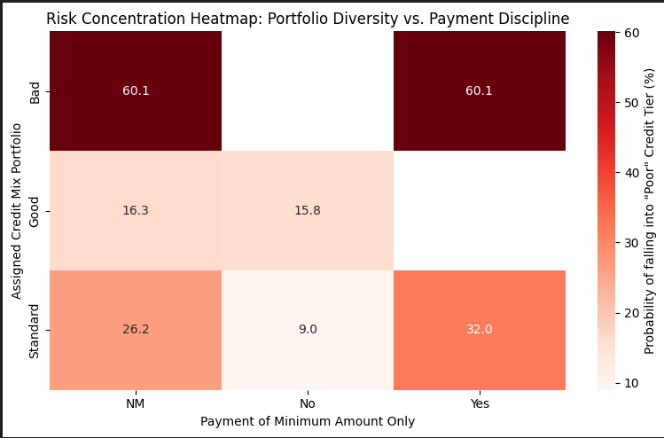
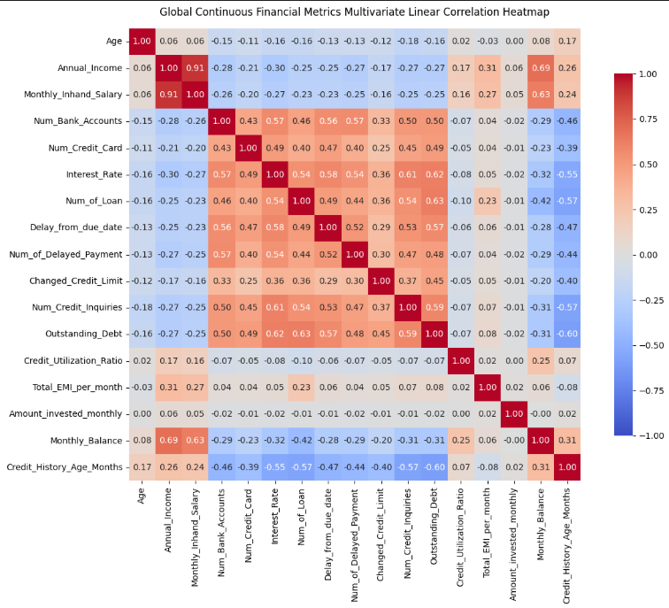

# Credit Score Classification using Machine Learning

Predicting customer creditworthiness by classifying individuals into **Good**, **Standard**, and **Poor** credit score categories using financial and behavioral data.

---

## Project Highlights

✅ Built a multi-class credit score classification model

✅ Performed extensive Exploratory Data Analysis (EDA)

✅ Engineered and selected features based on business relevance

✅ Compared multiple machine learning algorithms

✅ Achieved **0.8802 AUC** using XGBoost

✅ Identified key credit risk drivers influencing customer behavior

---

## Business Problem

Financial institutions need an efficient way to identify high-risk customers before defaults occur.

Traditional credit assessment methods often react after risk has already materialized. This project uses machine learning to proactively classify customers based on their financial profile and payment behavior.

### Key Questions Addressed

* Does paying only the minimum amount indicate higher risk?
* How much payment delay affects credit quality?
* Is income alone sufficient to assess creditworthiness?
* Which customer attributes contribute most to credit risk?

---

## Dataset Overview

The dataset contains customer financial and behavioral information, including:

* Annual Income
* Occupation
* Credit Mix
* Outstanding Debt
* Interest Rate
* Number of Loans
* Payment Behaviour
* Delay from Due Date
* Credit History Age
* Monthly Balance

### Target Classes

* Good
* Standard
* Poor

---

## Project Workflow

### 1. Data Cleaning & Preprocessing

* Missing value handling
* Data cleaning and validation
* Categorical feature encoding
* Feature transformation
* Feature reduction based on EDA findings

### 2. Exploratory Data Analysis

Business-focused analysis was conducted to uncover customer behavior patterns and risk indicators.

### 3. Feature Engineering

* Feature selection
* Data transformation
* Risk-based variable analysis

### 4. Model Building

Three machine learning models were evaluated and compared.

---

## Key Insights from EDA

### Minimum Payment Behaviour

Customers who consistently pay only the minimum due amount are significantly more likely to belong to the **Poor** and **Standard** credit categories.

### Payment Delay Threshold

A critical risk threshold was observed around **15–20 days**.

Customers exceeding this range showed a strong tendency to migrate toward lower credit categories.

### Income vs Credit Risk

Higher income improves the likelihood of maintaining a good credit score, but income alone is not a reliable predictor of creditworthiness.

Behavioral attributes proved to be more influential.

---

## Model Comparison

| Model               | Performance  |
| ------------------- | ------------ |
| Logistic Regression | 58% Accuracy |
| Random Forest       | 74% Accuracy |
| XGBoost             | 0.8802 AUC   |

### Final Selected Model

🏆 **XGBoost**

Reasons for selection:

* Best predictive performance
* Strong class separation
* Handles complex feature interactions
* Reduced misclassification across credit categories

---

## Model Performance

### Correct Classifications

| Credit Category | Correct Predictions |
| --------------- | ------------------- |
| Good            | 2,413               |
| Standard        | 8,297               |
| Poor            | 4,075               |

The model demonstrated strong performance across all three customer segments.

---

## Feature Importance

### Most Influential Features

#### Primary Driver

* Credit Mix

#### High Impact Features

* Payment Behaviour
* Outstanding Debt
* Interest Rate

#### Supporting Features

* Delay from Due Date
* Loan Burden
* Credit History Age
* Annual Income

---

## Results & Business Impact

The developed model can help financial institutions:

* Identify high-risk customers earlier
* Improve credit approval decisions
* Reduce default exposure
* Optimize credit limit allocation
* Enhance portfolio risk management
* Support data-driven underwriting

---

## Technologies Used

* Python
* Pandas
* NumPy
* Matplotlib
* Seaborn
* Scikit-Learn
* XGBoost
* Jupyter Notebook

---

## Project Images
Mix Matrix

Heap Matrix

